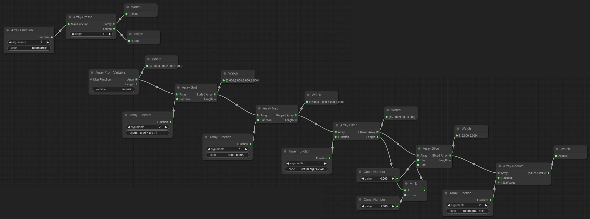
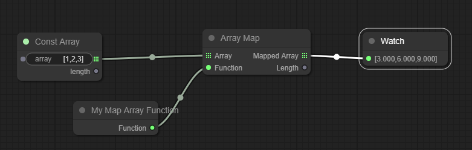

# LiteGraph-ArrayNodes
 A collection of Nodes for working with Arrays. Simply add the javascript file to your web page after litegraph.js to include the nodes.
```html
<script src="js/litegraph.js"></script>
<script src="js/litegraph-arraynodes.js"></script>
```


## Added Nodes

### Array Function
Used to supply callback functions to other `Array Nodes` that accept one.

The first input is the number of arguments to declare for the callback function. An argument with name `arg${i}` will be created for each i in **range [0, i)** which can be accessed within the function. This *does not* need to match the expected number of arguments of the correspending array function.

The second input is a string representing Javascript which will be used to create the function. Because this Node allows for non-trivial code execution the provided code should include a return statement. That being said, the UI available in LiteGraph makes it difficult to write and edit more complex code on the page so in practice these callback functions should be short.

### IMPORTANT!
`Array Function` uses Javascript's `new Function()` constructor. This is both the most direct implementation of the Node and also in keeping with LiteGraph's [implementation of math/Formula](https://github.com/jagenjo/litegraph.js/blob/master/src/nodes/math.js#L1128). However, this is only barely more secure than `eval()` and therefore [should be considered insecure](https://developer.mozilla.org/en-US/docs/Web/JavaScript/Reference/Global_Objects/Function/Function#:~:text=suffers%20from%20security%20and%20similar%20(but%20far%20less%20significant)%20performance). If this code is being run publicly it is recommended that you execute `LiteGraph.unregisterNodeType("Array/Function")` in order to remove it.

You can create new Array Functions by subclassing from `ArrayFunctionBase` and supply your own callbacks (which, presumably, you can confirm are secure):

``` javascript
class MyArrayMapFunction extends ArrayFunctionBase{
    static title = "My Map Array Function";

    constructor(o) {
        super(o);
        this._func = (element)=>{return element*3;};
    }
}

LiteGraph.registerNodeType("Array/MyMapFunction", MyArrayMapFunction);
```


## Array Nodes
The following Nodes (with the exception of `Array Reduce`) output both an Array and the length of the outputted Array.

### Array Create
Creates a new array using the `Array(length)` constructor. Has a `Length` property which dictates the length of the created array. The new Array is filled with null values. Accepts an optional input which is an `ArrayFunctionBase` and will be mapped to the new array (via `newarray.map(fn);`).

### Array From Variable
Creates a new array using the `Array.from(value)` method. Has a `Variable` string property which will be used to retrieve the desired variable from the global scope. Accepts an optional input which is an `ArrayFunctionBase` and will be mapped to the constructed array (via `newarray.map(fn);`).

## Array Manipulation Nodes
The following Nodes correspond to Javascript Array methods and all accept an Array Node as their first input.

### Array Map
Corresponds to Javascript's `inputarray.map(fn)` method. Requires an `ArrayFunctionBase` as the second input which will be used as map's callback argument.

### Array Filter
Represents Javascript's `inputarray.filter(fn)` method. Requires an `ArrayFunctionBase` as the second input which will be used as filter's callback argument.

### Array Reduce
Represents Javascript's `inputarray.reduce(fn[, initalValue])` method. Requires an `ArrayFunctionBase` as the second input which will be used as reduce's callback argument. Accepts an optional third input `Initial Value` which will be supplied to reduce if provided.

### Array Sort
Represents Javascript's `inputarray.sort([fn])` method. Accepts an optional second input which is an `ArrayFunctionBase` and will be used as sort's callback if provided.

### Array Slice
Represents Javascript's `inputarray.slice([start,end])` method. Accepts two optional inputs for start and end respectively; they should be integers per the slice method.